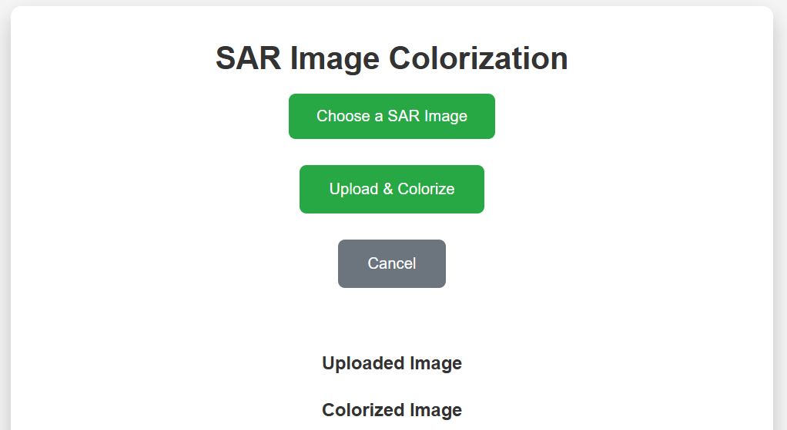

<h1>GAN Model for SAR Image Colorization</h1>

<h2>Model Diagram</h2>

The GAN model consists of two networks: a generator and a discriminator. The generator takes grayscale images and converts them into color images, while the discriminator evaluates the authenticity of the generated color images. Below is the architecture of the GAN model.

<!-- You will add the image of the model architecture here -->

        <!-- Section 2: User Interface -->
<h2>User Interface👥</h2>

The user interface allows you to upload grayscale images for colorization. The interface sends the images to the generator, which processes them and returns the colorized versions. Below is a screenshot of the interface.

            <!-- You will add the image of the user interface here -->

        <!-- Section 3: Output -->
<h2>Output</h2>

Once the GAN model colorizes the grayscale image, the output is displayed along with the original grayscale image and the ground truth (if available). Below is an example of the output generated by the GAN model.

            <!-- You will add the image of the generated output here -->

